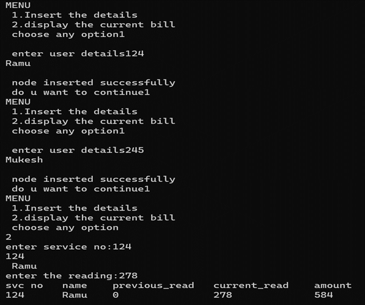
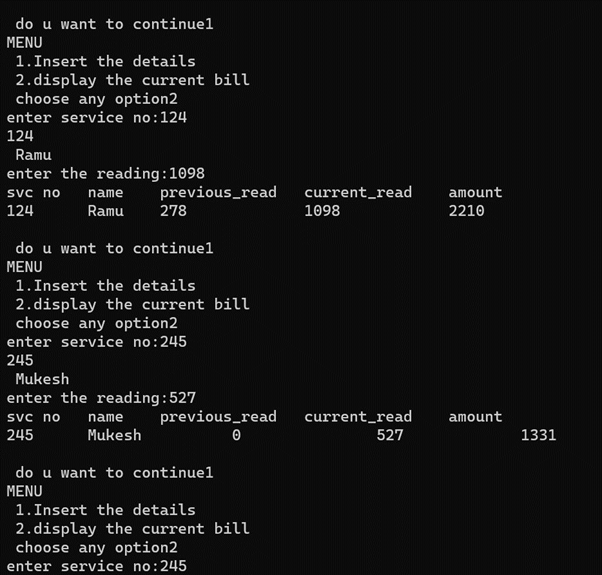
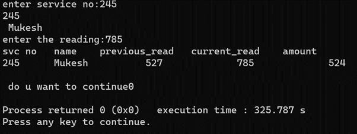

# Electricity-billing-system
Electricity billing system using Linked list data structure

# INTRODUCTION
This project is about “ELECTRICITY BILLING SYSTEM” in which we can get the details like holder name, service number and total units consumed by the user, calculate the bill with the help of total no of units consumed by the user and print the bill which consists of the holder name, service number and the amount which he/she has to pay. In this project we calculate the amount by using ‘Single linked list’.
 
# OUTPUT

